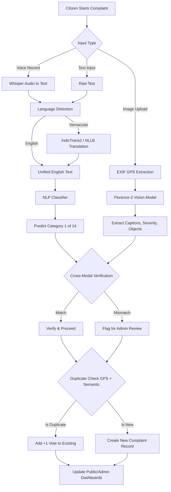

# Workflow of the Entire Project

This document provides a step-by-step walkthrough of the data flow and operational workflow within the **AI-Powered Civic Complaint Categorization and Routing System**. The workflow is divided into three main phases: User Input, Backend Processing, and Administrative Action.

## Phase 1: User Input (Frontend)

1. **Complaint Initiation**: A citizen opens the public React web app and navigates to the "Record Complaint" page.
2. **Media Capture**: 
   - **Audio**: The user can press a microphone button to record their complaint in their native language (e.g., Kannada, Hindi).
   - **Image**: The user uploads a photo of the issue (e.g., a pothole). The frontend uses `piexifjs` to extract latitude and longitude coordinates hidden in the image metadata.
   - **Text**: The user can manually type a description if they prefer.
3. **Submission**: The frontend compiles the audio blob, image file, text (if any), and GPS coordinates into a `multipart/form-data` payload and sends it to the backend `/complaints/record` endpoint.

## Phase 2: AI Pipeline & Processing (Backend)

1. **Audio Transcription**: If an audio file is received, the OpenAI `Whisper` model converts the speech into raw text.
2. **Translation**: The text (either transcribed or manually entered) passes through a language detector (`langid`). If it is not English, the `IndicTrans2` model translates it into English.
3. **NLP Classification**: 
   - The unified English text is pre-processed using `spaCy`.
   - The custom Scikit-Learn model extracts TF-IDF features and predicts the most likely civic category (out of 14 options).
   - An explainability path (`decision_path`) is generated to highlight which keywords triggered the classification.
4. **Visual Analysis**: 
   - The uploaded image is passed to `Florence-2`. 
   - The model generates a caption, detects objects (bounding boxes), and determines a severity score (Low, Medium, High, Severe).
5. **Cross-Modal Verification**: 
   - The system compares the category predicted by the NLP model with the objects detected by the Vision model.
   - If the NLP model predicts "Street Light" but the image model detects a "Pothole", the complaint is flagged with a **Mismatch Warning**.
6. **Duplicate Detection**: 
   - The system queries the PostgreSQL database for complaints within a 200-meter radius using Haversine distance.
   - It performs a Jaccard similarity check on the text of nearby complaints.
   - If a match is found, the system **rejects creating a new complaint** and instead adds a **Vote (+1)** to the existing complaint.
7. **Database Storage**: If it's a new issue, the record is saved to the database with a status of `Pending`.

## Phase 3: Display & Administrative Action (Dashboards)

1. **Public Dashboard (`ComplaintList`)**: 
   - Citizens can view all active and resolved complaints on an interactive Leaflet map and list view.
   - The list defaults to sorting by **Most Voted**.
   - Complaints with high votes receive glowing borders and "Critical / High Priority" badges.
   - Citizens can manually upvote existing complaints, further increasing their priority.
2. **Admin Dashboard (`AdminDashboard`)**: 
   - Government officials log in to view a comprehensive dashboard.
   - A "Top Priority Leaderboard" highlights the most urgent issues based on community votes.
   - Admins can review the AI's logic (NLP decision path, Florence-2 bounding boxes overlaid on the image canvas).
   - Admins update the status of the complaint (e.g., `Verified`, `In Progress`, `Resolved`).
   - Any status changes update the complaint's timeline, which is immediately visible to the public.
